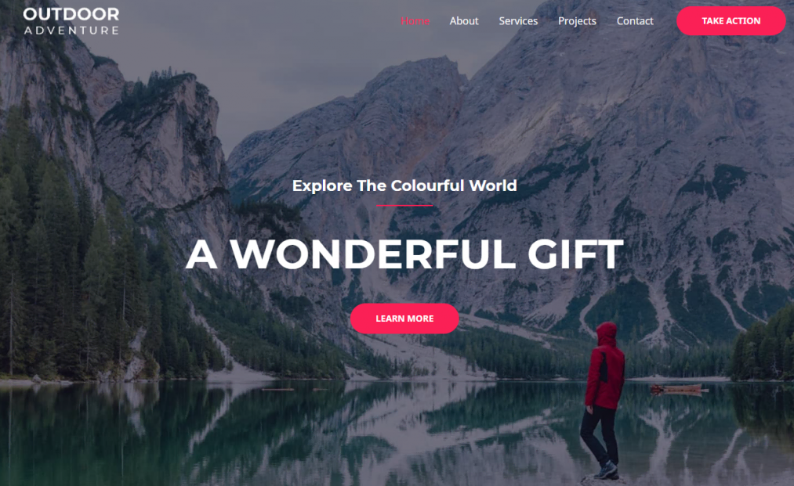

# HTML elements 

##  HTML carousel example
``` HTML
                                 <div class="carousel-item">
                                    <div class="container">
                                       <div class="row row-cols-1 row-cols-md-3 g-4">
                                          <div class="col">
                                             <div class="card" >
                                                
                                                <div class="card-body">
                                                   <h5 class="card-title">Be Creative</h5>
                                                   <p class="card-text small">Мобильное приложение и сайт для творческой студии Be Creative.</p>
                                                   <div class="text-end">
                                                      <a href="project.html" class="stretched-link"></a>
                                                   </div>
                                                </div>
                                             </div>
                                          </div>
                                          <div class="col">
                                             <div class="card" >
                                                
                                                <div class="card-body">
                                                   <h5 class="card-title">Агентство TravelFree</h5>
                                                   <p class="card-text small">Интерфейс сайта и система бронирования для туристического агентства.</p>
                                                   <div class="text-end">
                                                      <a href="project.html" class="stretched-link"></a>
                                                   </div>
                                                </div>
                                             </div>
                                          </div>
                                          <div class="col">
                                             <div class="card" >
                                                
                                                <div class="card-body">
                                                   <h5 class="card-title">Блог-платформа</h5>
                                                   <p class="card-text small">Сайт и мессенджер для студии развития творческого потенциала.</p>
                                                   <div class="text-end">
                                                      <a href="project.html" class="stretched-link"></a>
                                                   </div>
                                                </div>
                                             </div>
                                          </div>
                                       </div>
                                    </div>
                                 </div>
```
